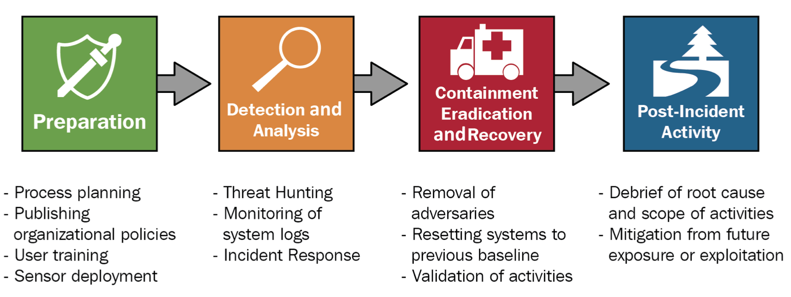

# 一文读懂威胁狩猎(Threat Hunting)

## 前言

很早就想针对威胁狩猎(Threat Hunting)来写一篇详细文章介绍体系，作为安全运营活动中非常重要的一环，国外已经由很多文章和体系的介绍，8月份的BlactHat USA专题演讲OTHF，但是国内介绍的很少。

## Threat Hunting简介

### 什么是Threat Hunting

首先，我们需要先明确什么是Threat Hunting， 在给出我自己的答案之前，我们先来看看行业内其他机构是如何理解Threat Hunting，如在SANS中有多篇文章给出了Threat Hunting的定义：

*Threat hunting is the proactive approach of searching and finding threats within an organization’s network that may go undetected for a long time due to weaknesses in traditional reactive detection systems and techniques.* [[5](https://www.sans.org/white-papers/39610/)]

和

*Threat hunting uses new information on previously collected data to find signs of compromise evading detection.* [[6](https://www.sans.org/white-papers/39025/)]

这些定义的前提都建立在威胁检测(Detect)无法完全发现所有的恶意入侵，造成这样的可能原因包括：检测技术存在缺陷、不断出现的新型攻击手法、检测的覆盖面不足等等。而Threat Hunting作为一种主动的周期性活动，可以用于发现威胁检测过程中因为上述原因而未被发现的威胁。在NIST的IPDRR安全框架中，Threat Hunting是用于弥补识别(IDENTIFY)、保护(PROTECT)和检测(DETECT)的不足，这一点我们会在下一小节**Threat Hunting在安全防御框架中的位置**中详细的展开介绍，并系统讲解安全防御框架中Threat Huting与其他安全活动之间的关系。

Active Countermeasures的COO、SANS的讲师Chris Brenton在Youtube上发表了一系列的教程[视频[14]](https://www.youtube.com/watch?v=lt1ld62Fids)来讲述Threat Hunting活动。Chris Brenton在2020年的文章[what is threat hunting and why is it so important [7]](https://www.activecountermeasures.com/what-is-threat-hunting-and-why-is-it-so-important-video-blog/)中简要讲了对Threat Hunting的理解以及重要性，观点主要包括：Threat Hunting是一个active/proactive活动，对象是所在组织的任何相关环境(原文中用词是everything)，内容是发现任何失陷的信号(signs of being compromised),而输出是是否失陷的评估。

在最近的BlackHat USA(2022年8月)会议中，来自IBM X-Force的专家John Dwyer和Neil Wyler分享了议题[Open Threat Hunting Framework (OTHF)[8]](https://www.blackhat.com/us-22/briefings/schedule/#the-open-threat-hunting-framework-enabling-organizations-to-build-operationalize-and-scale-threat-hunting-26702)，体系化的阐述了Threat Hunting活动框架。这篇文章在2.3小节中则是建议由开展Threat Hunting活动的组织在内部自己定义Threat Hunting以及相关活动，而定义的内容应该包括：1.hunting不针对已经能检出的威胁；2.是应该专项的、周期性开展的活动；3.活动是建立在“假设”的基础上。

在OTHF文章中也给出了多家安全厂商对Theat hunting的定义，内容大同小异，包括：

- hreat Hunting is a dedicated, continuous, hypothesis-based search methodology to reduce the time to detect adversaries operating within an environment that have yet to be detected.
- Threat hunting is the practice of proactively searching for cyber threats that are lurking undetected in a network. - CrowdStrike[9]
- Cyber threat hunting is a proactive security search through networks, endpoints, and datasets to hunt malicious, suspicious, or risky activities that have evaded detection by existing tools. - Trellix[10]
- Threat hunting is the practice of searching for cyber threats that might otherwise remain undetected in your network. - CheckPoint[11]

综上，我们总结一下Threat Hunting，需要包含一下内容：

1. Threat Hunting是基于环境已经失陷的假设，而且这种失陷未被现有的安全防御体系检测到，
2. 由安全运营相关的人员主动的开展分析、搜索活动，
3. 活动应该是周期性开展，
4. 活动应该由明确的产出，包括且明确的是否失陷的结论、失陷发现的分析手段(以规则、代码等形式展现)、对已有防御体系中不足的改进建议、缺失的检测数据、总结的新增检测规则等。
5. 目标是解决信息安全防御体系的痛苦金字塔(Pyramid of Pain)中顶端的痛点[13]，提高攻击者入侵的门槛。

### Threat Hunting在安全防御框架中的位置

Threat Hunting是安全防御框架和安全运营活动中重要的一环，在本章节我们来简单的介绍安全运营活动的框架，以及Threat Hunting在整个安全运营活动中的位置和作用，这样能够更好的帮助我们理解为何和如何开展Threat Hunting。同时我也在计划针对安全运营(SOC)单独写一盘详细的文章，请关注我的博客或者公众号。

NIST 信息安全事件处置指南[NIST.SP.800-61r2 [18]](https://nvlpubs.nist.gov/nistpubs/SpecialPublications/NIST.SP.800-61r2.pdf)中，将事件响应(Incident Response)的生命周期分为`准备`、`检测和分析`、`阻止、消除和恢复`、`后事件处置活动`四个阶段。在[The Foundations of Threat Hunting [17]](https://www.amazon.com/Foundations-Threat-Hunting-Organize-effective/dp/180324299X)这本书中，列举了IR生命周期每个阶段中会包含的安全运营活动列表，其中Threat Hunting归纳到了事件响应生命周期的`检测和分析`阶段，他将Threat Huting作为威胁检出的一项手段，也就是做为使用规则进行威胁发现和告警聚合的一种补充，主要目标还是尽可能的增加威胁的检出率，如下图所示。

而在[NIST的安全框架IPDRR[16]](https://www.nist.gov/cyberframework)中，将将安全活动分为`Identify`、`Protect`、`Detect`、`Respond`、`Recover`的闭环活动，覆盖了针对企业资产的完整信息安全保护的周期，简称IPDRR框架

IPDRR每一个阶段的细分项目内容如下：

其中`DE.CM`阶段表示`Security Continuous Monitoring: The information system and assets are monitored to identify cybersecurity events and verfy the effectiveness of protective measures`，他在`DE.DP`之前，`DE.DP`阶段主要内容包括`Detection processes and procedures are maintained and tested to ensure awareness of anomalous events`。而Threat Hunting涉及了DE.CM-1、DE.CM-2、DE.CM-3、DE.CM-6、DE.CM-7，用于发现环境和组织中潜在的恶意威胁，同时Threat Hunting的结果也会反馈DE.DP-5 `Detection processes are continuously improved`。

依照NIST的IPDRR框架和IR生命周期的理论体系，在[The Foundations of Threat Hunting [17]](https://www.amazon.com/Foundations-Threat-Hunting-Organize-effective/dp/180324299X)这本书中，把Threat Hunting做为一种检测的活动或者是手段，用于弥补传统检测中的不足，增加威胁的检出率。

我们再来看Gartner的安全运营模型，在Gartner [Security Operations Primer for 2022 [19]](https://www.gartner.com/en/doc/759058-security-operations-primer-for-2022)这篇文章中，安全运营包含三个因素、四个领域和四个目标的闭环，如下图：

三个因素是Gartner一直强调的人、流程、技术，安全的所有活动和目标都是围绕这三个因素开展，现代化的安全运营中心的建设同样是需要从这三个因素展开。Gartner的安全运营模型的四个领域包括：治理和运营、安全服务、安全监控/检测/响应技术、威胁和暴露面管理。其中，治理和运营主要强调安全团队的建设，安全人员的素质以及安全流程的规范，突出了人在信息安全运营过程中的作用；威胁和暴漏面管理则强调对保护的资产的范围确认，了解组织资产面临的威胁和风险；监控/检测和响应则更加注重安全事件的发现和处置闭环，强调处置的平台、流程和技术的建设；而安全服务的内容则是突出一系列的安全活动，如威胁狩猎、威胁情报、红蓝对抗，在威胁保护、响应之外，仍然需要一系列的安全活动来提高组织安全防护水平，关注于解决信息安全痛苦金字塔[13]顶端的内容。

Google在今年的云峰会上分享了优化安全运营的议题，主张通过自动化等各种手段进行安全运营加速(10x SOC概念)，在提升安全运营效率的同时注重安全运营的持续改进的闭环活动。在Google的运营体系中，将日志收集(Event Logging)和分析(Analyst)分成了不同的阶段，Threat Hunting一般作为更高阶的运营活动，在建设的后期开展进行。或者我们也可以理解Google认为开展Threat Hunting是需要在一定的建设基础之上的，日志收集的完备性对Threat Hunting的开展有一定的影响。当然，Threat Hunting的一个作用也是会推进安全运营、日志收集的完善和提高。Google的持续检测和持续响应闭环如下。

总结来说，Threat Hunting是：

1. 安全运营中的一项必须的**安全活动**
2. 以满足安全检测(Detection)阶段的目标开展，一般作为安全检测能力的补充，但是活动会贯穿整个运营生命周期
3. 可以以Threat Intelligence作为输入，它的结果也可以输出给Incident Response从而触发事件响应流程
4. 作为一种闭环的运营活动，执行的过程会对资产暴漏面管理(ASM)、日志收集、检测引擎和检测规则建设均有促进作用
5. 作为一种闭环的运营活动，对团队的建设和人员的技能水平有很大的促进作用
6. 成熟度很依赖现有检测日志、SIEM之类运营平台的完成度以及检测规则的优化，但并不是说只有成熟的安全运营建设完成才能开展
7. 处于安全运营高阶阶段，解决痛苦金字塔上层的问题

### Threat Hunting为什么重要而且必须

Chris Brenton在文章[what is threat hunting and why is it so important [7]](https://www.activecountermeasures.com/what-is-threat-hunting-and-why-is-it-so-important-video-blog/)中描述了威胁狩猎的重要性，他认为：Threat Hunting是连接安全防护和安全响应的活动、一般发现失陷是事件的6个月后、多数的失陷事件是第三方安全厂商发现的、现有的日志分析或SIEM平台只能检出2.5%的事件等等。

不得不说Chris Brenton在这里的数据有些过于夸张，我也不认为国内已经有专职开展安全运营活动的公司能容忍安全事件的检出水平低到这个级别。但现实中我们面临的情况也并不那么乐观，Chris Brenton的数据虽然夸张，但是观点并不错误。

我们需要明确一个核心观点，就是被动的检测无法发现所有的威胁。在这里，被动的检测是指部署在各个区域的传感器、集中的SIEM系统以及事件响应IR活动，这也是目前最常见的`检测->研判->响应`流程。无法完全发现的原因有很多，总结起来是两个方面：1.信息安全是一门对抗的学科，它不是考试做所有题都有答案答对就能拿到满分，它也没有一成不变的铁律让安全从业人员按图索骥的开展建设。我们看到这些年CS在不断更新隐蔽特征，新的0Day总是在不合时宜的时间出现，APT组织的不断演化，都意味着防御手段和方法也要不断进化。2. 安全防御仍然是木桶效应，企业的防御水平取决于做的最差的那项，攻击者天然的占据优势。如是否所有的资产都能梳理清楚并有足够的人员和预算来覆盖安全防护，边界的防御和纵深的防御同样重要，核心资产和边缘资产不一致的防护级别可能导致同样严重的结果。这些都注定了信息安全防御很容易达到一个及格线，但是想获得优秀甚至向九十分迈进，都需要花费巨量的资源。

另外，在信息安全

因为信息安全是一门对抗的学科，在安全运营中，威胁情报(Threat Intelligence)职能负责对外部的攻击态势进行跟踪以及及时预警。在这里我们多讲一下威胁情报和红队之间的职能区别，从目标上来说，红队是在扮演攻击者角色，发现现有防御体系中的漏洞，

1. SIEM解决不了所有的威胁发现
2. SIEM需要活动来驱动检测能力提高、规则的完备、接入数据的完备、防御框架的完备
3. 外部攻击手段的变化、新的0-Day漏洞的披露、不断变种的CS，都需要TI团队来跟踪以及及时预警，但是验证内部是否存在着类攻击、现有手段是否能够防御、是否有资产已经失陷，都需要TH团队来做这样的事情。

防御评价
攻击组织识别、攻击手段识别

1. 在发现攻击时候，攻击者已经在网络中存在了6个月， 2. 安全环境的变化，现在情报、数据的增多，需要一个响应的团队(TI)来跟踪威胁，而TH来验证威胁。3. 实际的检测能力不足，现有的日志职能分析出2.5%的威胁

team level benifits
• Turns unknown risks into known risks and allows them to be managed effectively
• Identifies adversarial activities that made it through existing defenses
• Provides an increased understanding of what threats current defenses have visibility into and where those defenses could be lacking
• Increases understanding of the enterprise for all personnel involved
• Validates/develops a documented network baseline and map
• Provides insight into potential system and network misconfigurations
• Identifies gaps in logging and network visibility

high level begifits
• Improves adherence to legal and regulatory requirements
• Aides in risk management decisions before or after major network reconfigurations, such as mergers with other organizations
• Validates threat intelligence reporting specific to the organization and the threat actors that are targeting them
• Can be utilized as a proof point for any investment adjustments into specific network security areas
• Re-enforces stakeholders' trust in the confidentiality, integrity, and availability of the network

## Movitation & preparation

where to start

Types of threat hunts - TH Category quad chart
• Can it be narrowed down to a specific threat actor?
• Can it be narrowed down to specific attack capabilities or techniques?
• Can it be narrowed down to a level of sophistication?

Intelligence驱动
TTP驱动
Anomaly驱动
[Stay ahead of the game: automate your threat hunting workflows](https://www.youtube.com/watch?v=UEwplUM5GlU)  6:20

Scopes of threat hunts

## Team Construct

## Methodologies

enables team to have repeatable process
consistently aligns its efforts
get every one on the same page

## Process

数据：[Security Datasets project](https://securitydatasets.com/)

Threat Hunting Tool:
- 微软 [MSTIC Jupyter and Python Security Tools](https://github.com/microsoft/msticpy)
- [Threat Hunting Project hunt tool](https://github.com/ThreatHuntingProject/hunter)
- https://github.com/reprise99/Sentinel-Queries

Threat Hunting Queries:
- [Sentinel](https://github.com/DanielChronlund/DCSecurityOperations) 和 [Blog](https://danielchronlund.com/2022/10/03/sentinel-hunting-query-pack-dcsecurityoperations/)
- [Bert-Jan](https://github.com/Bert-JanP/Hunting-Queries-Detection-Rules)

使用假设，然后通过SIEM中数据来验证这个假设是否正确

作用：补充现有的工具和方法、减少攻击的检测时间、识别网络中检测能力的差距，帮助保持领先于快速变化的威胁并提供快速响应这些威胁的机制。

方法：科学方法是通过实验检验假设以回答问题的过程。在医学、生物学、化学和物理学等领域的科学进步中，它的使用可以追溯到数百年前。
[Steps of the Scientific Method](https://www.sciencebuddies.org/science-fair-projects/science-fair/steps-of-the-scientific-method)

建立可重复的、标准化、可测试的、可度量的TH方法论，

searching something not currently being detected,  searching, not necessarily finding

isn't evil does not mean it isn't interesting

Threat Hunting和Adversary Simulation区别
TH 和 SOAR关系  Automating Everything
TH 和 IR关系
TH 由 TI驱动
TH 和安全巡检，覆盖面不同，目的不同

实验环境

- https://github.com/clong/DetectionLab

威胁狩猎101文档

https://www.secrss.com/articles/17910
https://www.anquanke.com/post/id/209909

https://www.sans.org/blog/ics-threat-hunting-they-are-shootin-at-the-lights-part-1/
https://www.sans.org/blog/ics-threat-hunting-they-are-shootin-at-the-lights-part-2/

ETDA
https://apt.etda.or.th/cgi-bin/aptsearch.cgi

## Reference

1. [SANS 2022 Threat Hunting Survey - Hunting for a Standard Methodology for Threat Hunting Teams](https://www.youtube.com/watch?v=n29whvCuwhc)
2. [Twitter ThreatHuntProj](https://twitter.com/ThreatHuntProj)
3. [https://www.threathunting.net/](https://www.threathunting.net/)
4. [https://resources.infosecinstitute.com/topics/threat-hunting/](https://resources.infosecinstitute.com/topics/threat-hunting/)
5. [Applying the Scientific Method to Threat Hunting - Jeremy Kerwin (thalesgroup.com.au) - SANS 2020](https://www.sans.org/white-papers/39610/)
6. [Building and Maturing Your Threat Hunting Program - David Szili (CTO @ Alzette Information Security) - SANS 2019](https://www.sans.org/white-papers/39025/)
7. [What Is Threat Hunting and Why Is It so Important? – Video Blog](https://www.activecountermeasures.com/what-is-threat-hunting-and-why-is-it-so-important-video-blog/)
8. [The Open Threat Hunting Framework: Enabling Organizations to Build, Operationalize, and Scale Threat Hunting - BlackHat USA 2022](https://www.blackhat.com/us-22/briefings/schedule/#the-open-threat-hunting-framework-enabling-organizations-to-build-operationalize-and-scale-threat-hunting-26702)
9. [https://www.crowdstrike.com/cybersecurity-101/threat-hunting/](https://www.crowdstrike.com/cybersecurity-101/threat-hunting/)
10. [https://www.trellix.com/en-us/security-awareness/operations/what-is-cyber-threat-hunting.html](https://www.trellix.com/en-us/security-awareness/operations/what-is-cyber-threat-hunting.html)
11. [https://www.checkpoint.com/cyber-hub/cloud-security/what-is-threat-hunting/](https://www.checkpoint.com/cyber-hub/cloud-security/what-is-threat-hunting/)
12. [Threat Hunting Tutorial: Introduction](https://www.youtube.com/watch?v=qrZsc5IkchI)
13. [A Framework for Cyber Threat Hunting Part 1: The Pyramid of Pain - Sqrrl Team](https://www.threathunting.net/files/A%20Framework%20for%20Cyber%20Threat%20Hunting%20Part%201_%20The%20Pyramid%20of%20Pain%20_%20Sqrrl.pdf)
14. [Cyber Threat Hunting Level 1](https://www.youtube.com/watch?v=lt1ld62Fids)
15. [Active Countermeasures Youtube 频道](https://www.youtube.com/c/ActiveCountermeasures)
16. [NIST网络安全框架](https://www.nist.gov/cyberframework)
17. [The Foundations of Threat Hunting](https://www.amazon.com/Foundations-Threat-Hunting-Organize-effective/dp/180324299X)
18. [NIST.SP.800-61r2](https://nvlpubs.nist.gov/nistpubs/SpecialPublications/NIST.SP.800-61r2.pdf)
19. [Security Operations Primer for 2022 - Gartner](https://www.gartner.com/en/doc/759058-security-operations-primer-for-2022)
20. [Hype Cycle for Security Operations 2021 - Gartner](https://www.gartner.com/en/doc/security-operations)
21. [Modernizing Autonomic Security Operations](https://services.google.com/fh/files/misc/us_pubsec_aso_transformation.pdf)
22. [A Framework for Cyber Threat Hunting White Paper - Sqrrl](https://www.threathunting.net/files/framework-for-threat-hunting-whitepaper.pdf)